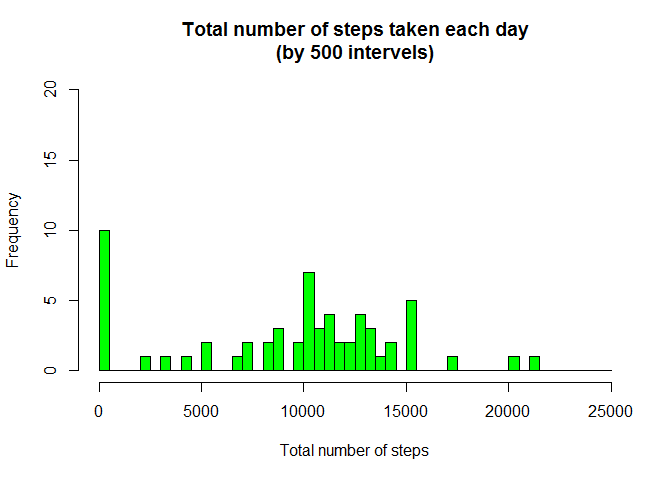
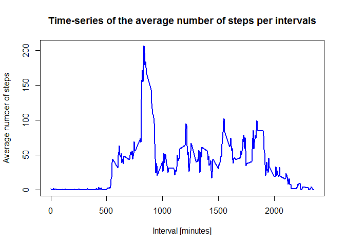

#Loading and preprocessing the data

```r
  activitydata <- read.csv("C:/CourseraProjects/RS/activity.csv", stringsAsFactors=FALSE)        
```

#What is mean total number of steps taken per day?

  for this part of the assignment, you can ignore the missing values in the dataset.
 
   1.Calculate the total number of steps taken per day

```r
  sumdata <- aggregate(activitydata$steps, by=list(activitydata$date), FUN=sum, na.rm=TRUE)
  names(sumdata) <- c("date", "total")
  head(sumdata)
```

```
##         date total
## 1 2012-10-01     0
## 2 2012-10-02   126
## 3 2012-10-03 11352
## 4 2012-10-04 12116
## 5 2012-10-05 13294
## 6 2012-10-06 15420
```

        2.Make a histogram of the total number of steps taken each day        

```r
hist(sumdata$total, 
     breaks=seq(from=0, to=25000, by=500),
     col="green", 
     xlab="Total number of steps", 
     ylim=c(0, 20), 
     main="Total number of steps taken each day\n(by 500 intervels)")
```

\
        
        3.Calculate and report the mean and median of the total number of steps taken per day

```r
vactorMeanAndMedian <- c(mean(sumdata$total), median(sumdata$total))
vactorMeanAndMedian
```

```
## [1]  9354.23 10395.00
```

#What is the average daily activity pattern?

  1.Make a time series plot (i.e. type = "l") of the 5-minute interval (x-axis) and the average number of steps taken, averaged         across all days (y-axis)


```r
stepsinterval <- aggregate(steps ~ interval, data = activitydata, FUN = mean)
plot(stepsinterval, type = "l" , col="blue", 
lwd=2, 
xlab="Interval [minutes]", 
ylab="Average number of steps", 
main="Time-series of the average number of steps per intervals")
```

\
  2.which 5-minute interval, on average across all the days in the dataset, contains the maximum number of steps?

```r
 stepsinterval$interval[which.max(stepsinterval$steps)]
```

```
## [1] 835
```

#Imputing missing values
        
 Note that there are a number of days/intervals where there are missing values (coded as NA). The presence of missing days may         introduce bias into some calculations or summaries of the data.
        
  Calculate and report the total number of missing values in the dataset (i.e. the total number of rows with NAs)

```r
sum(is.na(activitydata))
```

```
## [1] 2304
```

  Devise a strategy for filling in all of the missing values in the dataset. The strategy does not need to be sophisticated. 
  For example, you could use the mean/median for that day, or the mean for that 5-minute interval, etc.
  
  I will use the means for the 5-minute intervals as fillers for missing values.
        
  Create a new dataset that is equal to the original dataset but with the missing data filled in.

```r
activitydata <- merge(activitydata, stepsinterval, by = "interval", suffixes = c("",".y"))
nas <- is.na(activitydata$steps)
activitydata$steps[nas] <- activitydata$steps.y[nas]
activitydata <- activitydata[, c(1:3)]
```
  Make a histogram of the total number of steps taken each day and Calculate and report the mean and median total number of steps taken per day. Do these values differ from the estimates from the first part of the assignment? What is the impact of imputing missing data on the estimates of the total daily number of steps?

```r
stepsdate <- aggregate(steps ~ date, data = activitydata, FUN = sum)
barplot(stepsdate$steps, names.arg = stepsdate$date, xlab = "date", ylab = "steps")
```

\

```r
mean(stepsdate$steps)
```

```
## [1] 10766.19
```

```r
median(stepsdate$steps)
```

```
## [1] 10766.19
```
        The impact of the missing data seems rather low, at least when estimating the total number of steps per day.

#Are there differences in activity patterns between weekdays and weekends?

Create a new factor variable in the dataset with two levels - "weekday" and "weekend" 
indicating whether a given date is a weekday or weekend day.

```r
daytype <- function(date) {
        if (weekdays(as.Date(date)) %in% c("Saturday", "Sunday")) {
                "weekend"
        } else {
                "weekday"
        }
}
activitydata$daytype <- as.factor(sapply(activitydata$date, daytype))
```

Make a panel plot containing a time series plot (i.e. type = "l") of the 5-minute interval (x-axis) and 
the average number of steps taken, averaged across all weekday days or weekend days (y-axis).

```r
par(mfrow = c(2, 1))
for (type in c("weekend", "weekday")) {
        steps.type <- aggregate(steps ~ interval, data = activitydata, subset = activitydata$daytype == 
                                        type, FUN = mean)
        plot(steps.type, type = "l", main = type)
}
```

\

  
